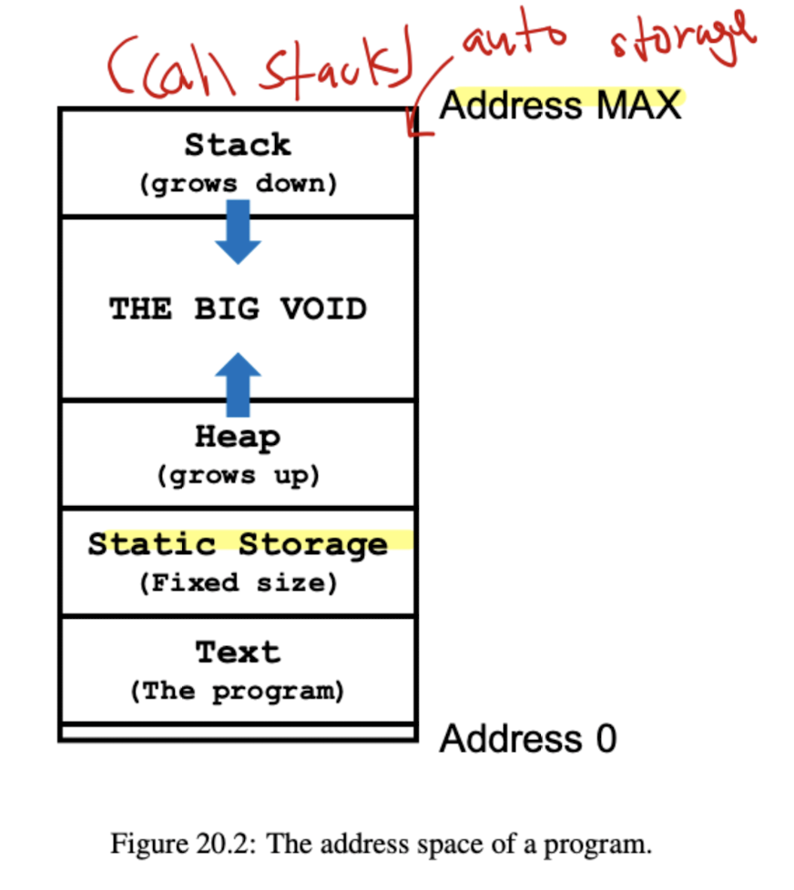
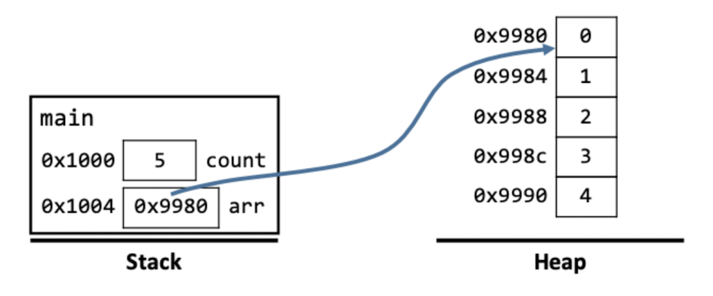

# EECS 280 WN 2021 Final Learning Objectives

This document contains student-written responses to Sections 11-19 of the learning objectives listed [here](./media/Final_Learning_Objectives.pdf). For Sections 1-10, see [Midterm Learning Objectives](../midterm/midterm.md). Responses here are a combination of

1. Paraphrased explanations and summaries, and
2. Notes taken verbatim from [Prof. Amir Kamil's EECS 280 Lecture Notes](https://eecs280staff.github.io/notes/).

Table of Contents: GitHub now has built-in TOC at the top left of the Markdown preview.

#### Quick Reference for Big O Notation:


## 11. Dynamic Memory

### a. Understand the difference between the stack and the heap

Both stack and heap make up a program's **address space** (see diagram in next section).

Differences:

||Stack|Heap|
|-|-|-|
|Resource allocator|Program|Programmer|
|Memory storage duration|**Automatic** (lifetime tied to particular scope)|**Dynamic** (object explicitly created and destroyed by programmer)|
|Growth|Grows downward toward "The Big Void"|Grows upward toward "The Big Void"|

### b. What the stack and heap look like in memory (memory model)



### c. Understand how the scope of dynamic memory variables can be controlled

With the `new` and `delete` keywords. Dynamic memory variables can generally be freed in two ways:

1. `delete` keyword (frees up the memory of the pointed-to object)
2. Class-type destructor, if the dynamic memory object is a Class-type object; run when
   - container of class-type objects (e.g. array) goes out of scope and container's destructor is called
   - class-type object goes out of scope

### d. Identify use of dynamic memory in code

Generally look out for `new` keyword, or any object whose duration is not either static or automatic storage duration (i.e., not managed by compiler/program).

### e. Understand that the ‘new’ operator allocates space in the heap and evaluates to its address

According to lecture notes pg. 133, `new` does:

- **Allocates** space for object *of the given type* on the heap
- **Initializes** the object according to given initialization expression
- **Evaluates** to the *address* of the newly created object
  - this makes sense, because e.g., `Animal *ptr = new Animal("Simba");`

### f. Know when the delete operator should be used and how to use it

`delete` does not kill the pointer object; it follows the pointer to the object it is pointing to, and kills that object. After using `delete`, if your pointer variable does not go out of scope immediately, set it to `nullptr`, e.g., (After deletion the pointer may still be reused to point to another object) If the pointer is not set to nullptr it becomes a dangling ptr.

```cpp
int main() {
    Animal *ptr = new Animal("Simba");
    delete ptr;
    ptr = nullptr;

    Animal *ptr2 = new Animal("Scar");
    ...
}
```

### g. Create and use dynamic arrays

Main difference between dynamic arrays and "regular" arrays is: for dynamic arrays, the **size** of the array does *not* need to be known at compile-time.

Create dynamic array:
```cpp
int main() {
    cout << "Size: ";
    int count;
    cin >> count; // only set at run-time
    int *arr = new int[count]; // dynamic size
    ...
}
```

From lecture notes pg. 135, a `new` array expression does:

- **Allocates** space for an array of given number of elements on heap
- **Initializes** array elements according to initialization expression (or default initialize elements if no initialization provided)
  - e.g., `int *arr = new int[count]{}; // set all to 0`
  - e.g., `int *arr = new int[count]{1,2,3}; // set first three elts to 1,2,3 and rest to 0`
  - e.g., `int *arr = new int[count]; // default initialize to junk`
- **Evaluates** to *address of the first element* of the newly created array

#### i. Be able to use the specific delete[] operator when deleting dynamic arrays

Delete arrays like so: `delete[] dynamic_arr;`. 

Using the wrong deletion operator results in *undefined behavior*. Also, **only** use `delete[]` on the *address of first element*, not address of any other element.

#### ii. Be able to identify when it is needed to iterate through a dynamic array to delete elements in the array

This is when the elements of the dynamic array themselves are **pointers to/addresses of Class-type objects managing dynamic resources**, so that you need to call `delete` to free up memory of each dynamically allocated object.

Prof. Juett said, in Discord, "That would be in the case that the array contains **pointers to things that are also on the heap.**"

### h. Follow the scope of an object and identify where it is created/destroyed (ex. writing ctor and dtor print statements in the correct order)

Few notes:

- Copy ctor is called when an object is *passed by value* (watch out for this!)
- Explicitly calling `delete` on a pointer to a heap object will run that instance's dtor first, then the other stack instances' dtors will run when they go out of scope
  - this is important in cases where your dynamic object is created before a stack object, but also freed (dtor runs) *before* that stack object
- Dtor runs whenever pointer goes out of scope (for stack objects)!

### i. Identify and correct dynamic memory errors

#### i. Double free, memory leak, etc.

Assume following program:

```cpp
int main() {
    int *ptr = new int(3);
    int *ptr2 = new int(5);
    // <Example>
}
```

|Dynamic-memory error|Example|Explanation|Reference|
|-|-|-|-|
|Memory Leak|-|Failed to free up heap memory using `delete ptr`|LN pg. 138|
|Orphaned Memory|`ptr2 = ptr;`|(Memory for) object at address returned by `new int(5)` is orphaned|LN pg. 138|
|Double Free / Double Delete|`delete ptr; delete ptr2;`|Both point to same heap memory object|LN pg. 138|
|Bad Delete|`delete[] ptr;`|Applied wrong `delete` operator; not dynamic array. Leads to **undefined behavior**|LN pg. 139|
|Dangling Pointer|(before `ptr2` line) `delete ptr;`, then `*ptr;`|`ptr` points to dead object (already freed). Leads to **undefined behavior**|LN pg. 139|

Fix for dangling pointer: `ptr = nullptr;` if `ptr` not immediately going out of scope

### j. Develop code that uses dynamic memory and prevents memory leaks and other errors

Watch out for above errors; run valgrind if possible.

### k. Draw memory diagrams with dynamic memory (drawing the heap)

Lecture notes pg. 135 has a good example:



### l. Be able to explain RAII, and why using RAII is beneficial

RAII stands for **R**esource **A**cquisition **i**s **I**nitialization, and is also known as "scope-based resource management". This scheme essentially says to manage dynamic memory using class-type objects, where dynamic memory allocation is done by the constructor (with `new`) and dynamic memory deletion/release is done by the destructor, either implicitly or explicity (with `delete`).

RAII is beneficial because it ties the management of the resource to the **lifetime of the class-type object**.

### m. Develop code that makes use of RAII

Here is an example (lecture notes pg. 142):

```cpp
class DynamicIntArray {
  public:
    // constructor uses `new` keyword to allocate dynamic resource
    DynamicIntArray(int size_in) : 
      elements(new int[size_in]), num_elements(size_in) {}
    
    // destructor explicitly deletes dynamic array
    ~DynamicIntArray() {
      delete[] elements;
    }

    ...

  private:
    int *elements;
    int num_elements;
}
```

## 12. The Big Three

Refers to:

1. copy constructor
2. assignment operator
3. destructor

### a. Be able to identify classes which need custom implementations of the big three

In a nutshell, classes that create and manage dynamic memory.

Importantly, iterators *usually* don't need to implement custom Big Three, because they don't create (with `new`) any heap-allocated pointers to elements

- e.g., `List<T>::Iterator`s point to **existing** `List<T>::Node`s but don't create `new` `List<T>::Node` objects on the heap

### b. Be able to correctly implement the big three if needed

Copy constructor:

```cpp
class Animal {
  public:
    Animal() {}

    Animal(const Animal &other) : // as much as possible pass by reference-to-const,
                                  // must be reference becos pass-by-value will invoke copy ctor
      foods(new int[other.food_size]), // allocate dynamic resource
      food_size(other.food_size) { // shallow copy all other static resources (non-resources)
      // anything else that couldn't be done via member-initialization list  
    }

    ...
  
  private:
    Food *foods; // array
    int food_size;
}
```

Assignment operator:

```cpp
class Animal {
  public:
    Animal() {}

    Animal &operator=(const Animal &rhs) { // return by reference! (for `a = (b = c)`)
        if (this == rhs) { // self-assignment check
            return *this;
        }
        delete_resource(); // delete all existing dynamic resources
        copy_resource(rhs); // deep copy resources from rhs
        return *this; // return by reference!
    }

    ...
  
  private:
    Food *foods; // array
    int food_size;
}
```

Destructor:

> Note: If dynamic binding relationship exists, always mark Base class destructor as `virtual`!

```cpp
class Animal {
  public:
    Animal() {}

    virtual ~Animal() {
    }
}

class Tiger : public Animal {
  public:
    Tiger() {}

    ~Tiger() {
        delete[] foods; // use correct `delete` operator!
    }

    ...

  private:
    Food *foods; // array
    int food_size;
}
```

### c. Be able to explain the difference between shallow and deep copies

|Shallow|Deep|
|-|-|
|member-by-member copy, such that "copy" of dynamic resource results in copying pointer value|shallow copy non-resources, creates new dynamic resources with element-wise value copies|

### d. Be able to explain why destructors should be marked as virtual in classes that make use of inheritance

If destructor of base class not marked as virtual, then the destructor of the compile-time (static) class will be invoked. This is because destructor will be **statically bound**, if it is not marked as `virtual`.

### e. Identify errors in big three implementations or shallow copies and how they could cause dynamic memory errors later on

Refer to above section on *correctly* [implementing Big Three](#b-be-able-to-correctly-implement-the-big-three-if-needed) for tips on what to watch out for. Refer to [dynamic memory errors](#i-identify-and-correct-dynamic-memory-errors) to see the common errors that would result.

### f. Understand what the default, compiler generated versions of the big three do

Default copy constructor: *Shallow* copies member-by-member; i.e., will **copy pointer value** to heap object
Default assignment operator: *Shallow* copies member-by-member
Default Destructor: Implicitly invokes destructor of all class-type members

## 13. Containers and Templates

### a. Be able to identify time complexities of insert, find and remove for both Sorted and Unsorted Sets

Implementation-dependent. 

Assuming sets implemented using **dynamic arrays**:

||`insert`|`find`|`remove`|
|-|-|-|-|
|Sorted Set| $O(N)$ | $O(\log_2N)$ | $O(N)$ |
|Unsorted Set| $O(1)$ | $O(N)$ | $O(1)$ |

Assuming sets implemented using (relatively balanced) **binary search trees**:

||`insert`|`find`|`remove`|
|-|-|-|-|
|Sorted Set| $O(\log_2N)$ | $O(\log_2N)$ | $O(1)$ |

### b. Be able to explain an advantage of using templates when defining the interface for a container

Reduces code duplication, supports code reuse. Compiler instantiates a parameterized class using the same interface.

### c. Be able to use templates properly

Example (from lecture notes pg. 170 List Template):

```cpp
template <typename T>
class List {
  public:
    List();

    void empty() const;

    T &front();

    void push_front(const T &datum); // pass-by-reference

    void pop_front();

    void push_back(const T &datum); // pass-by-reference

    ...

  private:
    struct Node {
        T datum;
        Node *prev;
        Node *next;
    };

    Node *first;
    Node *last;
};
```

### d. Be able to identify various types of containers and each underlying functionality (i.e. some containers have member functions like push_back())

Always pay attention to:

- member function signatures (i.e. identifier (name), parameters)
  - is `this` pointer `const`?
  - are parameter variables `const`? pointers/references/values?
  - RMEs
- return type
- data representation
- use of dynamic memory
- custom Big Three?

### e. Be able to use various types of containers when given a problem

Some common useful ones:

- `std::list` (sequential)
- `std::pair`
- `std::map` (sorted, BST under the hood)
- `std::vector` (dynamic random-access array)

### f. Be able to explain why operator overloading is necessary

Lecture notes pg. 117:

"C++ [says] user-defined types should have the **same access to language facilities** as built-in types. Since operators can be used with built-in atomic types, C++ allows operators to be applied to class types through operator overloading."

Operator overloading is necessary because the default functionality of operators are often not useful and/or don't produce the desired effects for user-defined types and containers, e.g. `operator+` for user-defined set container.

### g. Be able to write an implementation of an operator overload

Union `operator+` example, pg. 117:

```cpp
class IntSet {
    ...
  public:
    IntSet operator+(const IntSet &rhs) const;
}

// overload `operator+`
IntSet IntSet::operator+(const IntSet &rhs) const {
    IntSet result = *this;
    for (int i = 0; i < rhs.num_elements; ++i) {
        result.insert(rhs.elements[i]);
    }
    return result;
}
```

## 14. Recursion

### a. Be able to identify recursion, tail recursion, tree recursion, and structural recursion problems

Recursion is when a function calls itself by taking a "recursive leap of faith" until it reaches a base case.

Linear recursion would mean that at most only one recursive call is made in each invocation of the function. Keep note that this does not mean that there is only one call in the body, as there could be an if else statement which determines which call to make.

Tail recursion is when the recursive call is the last call made in the function. All of the work must be done in the active flow before the call takes place.

Tree recursion is if a single invocation of the function can make more than one recursive call. Such a function subdivides a recursive case into multiple subproblems.

### b. Be able to write a recursive function given a problem

#### i. Break down problem into smaller sub-problems

First identify the base case. ex. What if there is no root to start off? What if the node parameter is a nullptr?
Then look at the root, its children, and in some rare cases, their children. If you need to go too far down the tree in your implementation, something is wrong.

### c. Understand how to write a structural recursive function

### i. Break down data structures into smaller data structures

### d. Be able to write an appropriate base case given a problem

### e. Be able to differentiate between the memory complexity of normal linear recursive functions and tail recursive functions

### f. Be able to draw a memory diagram of the stack given a recursive function call

### g. Convert iteration into recursion and recursion into iteration

### h. Understand when to use recursion vs. iteration

## 15. BSTs

### a. Be able to identify the difference in time complexities between removing, inserting, and finding an item in a BST vs an Unsorted Set and a Sorted Set

#### i. Best case, worst case, and average case

### b. Be able to draw a BST representation in memory with pointers

### c. Be able to use recursion to implement functions such as insert, find, and height for a BST

### d. Be able to identify whether the big three is needed for a BST (and why) and properly implement the big three using recursion in a BST interface

### e. Be able to write preorder and inorder traversals of BSTs

### f. Be able to identify and explain the stack frame creation/destruction when using recursive functions in a BST

## 16. Iterators and Functors

### a. Be able to traverse through a container with an iterator

### b. Be able to identify scenarios in which an iterator can be invalidated

### c. Be able to explain the concept of an end iterator

### d. Be able to define what a functor is

### e. Be able to identify at least one advantage in using functors

### f. Be able to use a functor in code

### g. Be able to define what a predicate is

### h. Be able to define what a comparator is

### i. Be able to write a predicate

### j. Be able to write a comparator

### k. Be able to identify that range based for loops are effectively the same as traversal by iterator

### l. Iterators are meant to provide a standardized interface for traversing through different types of containers

#### i. Know when to dereference an iterator

### m. Know how to iterate through a container using iterators

### n. Understand why iterators should not implement the big three, even though they reference to dynamic memory

### o. Be able to define what a function pointer is

### p. Be able to use a function pointer in code

## 17. Linked Lists

### a. Be able to identify at least two differences between using a linked list and a vector

### b. Be able to draw a linked list representation in memory

### c. Be able to declare a linked list iterator

### d. Be able to use a linked list iterator

### e. Be able to define friend classes

### f. Be able to use friend classes

### g. Be able to add and delete nodes into the linked list without creating any memory errors

### h. Perform operations on linked lists without errors (chopping a list, stretching)

### i. Explain how linked lists are recursive data structures

### j. Explain why iterators are necessary for traversing a linked list

### k. Explain why linked lists are better (have faster time complexity) than arrays/vectors for certain operations (removing from the top, middle)

## 19. Impostor Syndrome

### a. Be able to identify common characteristics of impostor syndrome

### b. Be able to identify steps that can be taken to overcome impostor syndrome

### c. Understand that most individuals feel imposter syndrome at some points in their careers

### d. Understand that certain groups of individuals are more prone to feeling imposter syndrome through their careers
