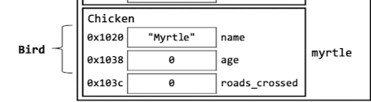
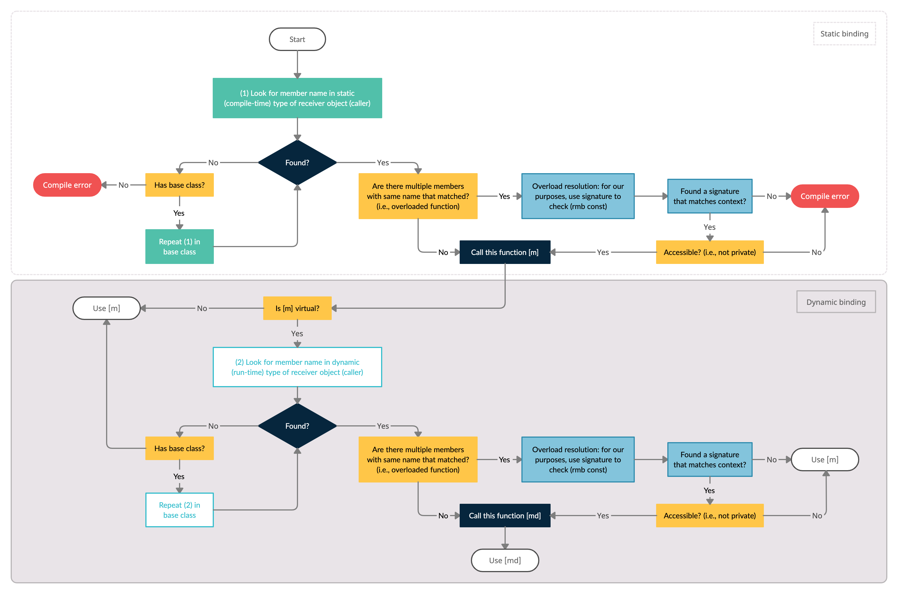

# EECS 280 WN 2021 Midterm Learning Objectives

Table of Contents: GitHub now has built-in TOC on the top left of the Markdown preview.

## 1. Memory Models/Function Calls and the Stack

### Understanding static, automatic/local, and dynamic storage durations

| Static | Automatic/Local | Dynamic |
|---|---|---|
| This is memory that exists throughout the whole lifetime of the program (e.g. global variables) | This is what we call "local scope", i.e. memory that gets automatically assigned to (and destroyed after) the parameters and internal variables of each function on the call stack | This is memory created and destroyed by the programmer, as in `new` and `delete` |

### Being able to correctly draw a memory diagram

- Draw **box**, label box with **name of function**
- Write all **parameter variables and internal variables** in the box
- For references, don't draw a box for that variable; otherwise draw a box beside the variable name
- For **references**, draw an arrow pointing to the actual object it is aliasing
- For **pointers**, draw an arrow starting from inside its box to the box of the object it is pointing to
- For **objects with value**, write the value in the box

### Define the difference between a variable and an object

| Variable | Object |
|---|---|
| A variable is a name that refers to an object in memory. A variable exists at **compile time**. A variable is a concept associated with source code. | An object is a piece of data in memory, located at some address in memory. An object exists only at **runtime**. An object is associated with the runtime. |

### Be able to define the difference between compile time and runtime

| Compile time | Runtime |
|---|---|
| Compile time is the time at which the source code is converted into an executable code (binary). Compile time errors are errors that arise due to wrong syntax and/or semantics, e.g. type mismatch. | Runtime is the time at which the executable code is running. Runtime errors are the errors which occur during the execution of the program and are usually undefined behavior, errors arising from dynamic typing and binding, or errors that are usually introduced by side effects that the compiler couldd not detect at compilation. |

## 2. Testing and Procedural Abstraction

### Explain the purpose of procedural abstraction and why it is valuable

Procedural abstraction allows a user of our API and/or functions to only need to know what our function does without needing to care about the implementation details or about how it works. It only requires that a user knows the **interface** of a function. This is good because the underlying implementation can change but the user need not concern themselves with the implementation(s) of the change.

### Design/develop thorough test cases

General tips for writing test cases:

- Write simple (positive) test case
- Identify **equivalence partitions**
  - These are groups of function inputs that are *significantly* from each other; e.g. in testing division, the equivalence partitions are {negatives, 0, positives, negative/positive}. It would not add value to have two test cases with inputs (+3, +2) and (+100, +2), for example, because they belong to the same equivalence partition (i.e. positives).
- Test **boundary values**
- Imagine how the function would be implemented, and come up with edge cases

### Identify bugs in code and identify how to fix the bug

Tips:

- Pointer errors
  - Array decay, C-style strings without `'\0'`, etc.
  - Indexing out of bounds of arrays
- Value semantics when reference semantics is expected or should be used
  - e.g. swapping integers in a function `void swap(int a, int b)` that does not use references; should be `void swap(int &a, int &b)`
- Polymorphism
  - Dynamic/Static binding errors
  - Look out for **un-implemented functions in derived classes** that would make the class abstract and non-instantiable (e.g. Fall 2019 Q4e)
  - Check that all virtual/override pairs have **same signature**
  - Always keep in mind static/dynamic type of pointer
  - If no indirection used, object slicing occurs and static type is simply the type it is sliced to

### Translate problems into code (and vice versa) / Explain what a given code snippet does

Tips:
- Come up with 1-2 more examples of problem to motivate a solution
- **Working** solution is better than *efficient* one
  - Copy-paste code if you have to, as long as it works it's fine

## 3. Pointers

### Understand that the value of a pointer is a memory address

Tips/Notes:

- In memory diagrams, essentially this means the value in the box should actually be a hexadecimal number representing the memory address of the object it is pointing to
- Pointer arithmetic takes into account the pointer type

### Use pointers to access elements within an array

Given `int arr[3][2] = { {1, 2}, {3, 4}, {5, 6} }`.

Some examples:

- Subscript operator `[]`: 
  - `arr[0]` yields `{1, 2}`
  - `arr[0][1]` == `*(arr[0] + 1)` == `*(*arr + 1)` yields `2`
- Dereferencing `*`:
  - `*arr` == `*(arr + 0)`  == `arr[0]` yields `{1, 2}`
  - `*(arr + 2)` == `arr[2]` yields `{5, 6}`

### Understand difference between traversal by pointer and traversal by index

The difference is mainly in the semantics and how you achieve the same outcome.

#### Traversal by pointer

The idea of traversal by pointer is that instead of using a handy integer index to subscript your pointer with, you declare a separate starting pointer variable that initially points to the start of the array, and increment this pointer one element byte-width down the array at each loop iteration:

```cpp
// Given int arr[] = {1, 2, 3}, size is 3.
// Remember arr decays to int* when used as rvalue (RHS)
for (int *start = arr; start < arr + 3; ++start) {
    // Remember to dereference start pointer!
    *start = ...
}
```

The key thing to note from the above example is the stopping condition, which is defined as `arr + 3`. This makes sense because we have ensured `arr` is always pointing to the start of the original array `arr` (by declaring a separate `int*` pointer `start`).

#### Traversal by index

Traversal by index is almost the same, just that its syntax is slightly different:

```cpp
// Given int arr[] = {1, 2, 3}, size is 3.
// Don't *exactly* need to bother that `arr` decays to pointer
for (int i = 0; i < 3; i++) {
    // Access by subscripting
    arr[i] = ...
}
```

### Recognize and correct common pointer errors

Some common pointer errors:

- **Dereferencing an uninitialized pointer** before assigning a well-defined value to it
  - e.g. `int *ptr; *ptr = ...` Here, the sin is in the dereferencing.
  - *Possible* but not-so-clean fix is doing `int *ptr = nullptr; *ptr`; dereferencing `nullptr` mostly crashes program (but still leads to undefined behavior)
- Pointing to an object past the object's lifetime
  - e.g. pointing to an object in a previous function call that has concluded because of non-conformance to reference semantics (lecture notes p. 23)

### Explain actions that can cause undefined behavior or runtime error (e.g. not initializing pointer)

See notes on common pointer errors for examples and a short description/explanation.

## 4. Arrays

### Be able to explain similarities and differences of traversal by index and traversal by pointers

| - | Traversal by index | Traversal by pointers |
|---|---|---|
|Similarities|Both use **pointer arithmetic** to iterate through elements|Both use **pointer arithmetic** to iterate through elements|
|Differences|Uses an integer index to subscript the array pointer|Uses a separate pointer variable to step through array|

#### Understand how arrays look in memory

Arrays are contiguous chunks of memory, at least the size of the number of elements.

#### Use traversal by index

See [similar section in Pointers](#traversal-by-index)

#### Use traversal by pointer when working with arrays

See [similar section in Pointers](#traversal-by-pointer)

### Be able to explain array decay

Arrays are objects without *value* as a whole. Array decay is when the compiler converts the array into a pointer to the first element in the array, when an array is used **in a context where a value is required**.

Note: As in lecture notes, "when an array object's value is not required, it does not decay into a pointer. For example, the address-of (`&`) operator **requires** an object but not its *value* - thus, applying `&` to an array produces a pointer to the whole array, not a pointer to an individual element nor a pointer to a pointer."

### Detect when array decay happens in a block of code

It happens generally at all times on the RHS of an assignment or expression (except for the case of `&` as noted above); more specifically in any context where a value is required.

### Understand that arrays are not class-type objects and they are basically pointers

Class-type objects are compound objects (e.g. `struct`s and `class`es) associated with **values**, whereas arrays do not have a value as a whole.

## 5. Compound Objects and ADTs

### Students should be able to define and create an ADT (e.g. define constructors properly, etc.)

**Class-type objects** (compound objects) are objects composed of member subojects, each which may be of a different type.

An **abstract data type (ADT)** separates the interface of a data type from its implementation, and it encompasses both the data itself as well as functionality on the data. (e.g. C++ `string`)

Creating ADTs:

- C-style
  - When defining functions, follow naming conventions like prepending any function name with `Structname_`
  - **No scope resolution** operators!
  - Constructors do **not** have member-initializer lists!

- C++-style
  - When defining functions separate from header file, use scope resolution operator like `Structname::function_name()`
  - Ues member-initializer list where possible
    - in C++, some variables can only be initialized, e.g. arrays, references, `const` variables!
  - Delegating constructors
    - Within a class, in using another constructor, the member-initializer list must contain **only** the call to the other constructor
  - Call parent constructor somewhere in member-initializer list, preferably first
    - Lecture notes p. 93: "When creating a [child] object, the invocation of the [parent] constructor is the first thing that happens in the [child] constructor... **regardless of whether or not an explicit call** to the [parent] constructor appears, and **regardless of ordering of the member-initializer list**"

#### Translate a problem into ADT

Tips:

- What members do you need?
- What operations do you need to perform?
- What can you make private (if `class`)?

#### Understand motivation when using ADTs

This is covered in [definition of ADTs](#students-should-be-able-to-define-and-create-an-adt-eg-define-constructors-properly-etc) above.

### Identify when interface has been broken

### Be able to use the scope resolution operator properly

Use it when:

- Defining class functions in separate file from header file
- Calling function in parent class from child, i.e. `Parentclass::function_name()` (see Fall 2019 Q3)

### Understand how to access members of a class type object using the dot operator

Given:

```cpp
class A {
    void f1() {}

    void f2() {}
}
```

Tips:

- Simply `A a;` to create an object of type `A`, then call `a.f1()`

### Understand how to access members of a pointer to a class type object using the arrow operator

Always remember that arrow `->` operator is simply **dereference-then-dot**, as such: `ptr->f1()` == `(*ptr).f1()`

## 6. Strings

This is one of the most important tables from lecture notes:

|| C-style strings | C++ strings |
|---|---|---|
|Library Header|`<cstring>`|`<string>`|
|Declaration|`char cstr[]; char *cstr;`|`string str`|
|Length|`strlen(cstr)` (returns `size_t`)|`str.length()` (returns `size_t`)|
|Copy Value|`strcopy(cstr1, cstr2)`|`str1 = str2`|
|Indexing|`cstr[i]`|`str[i]`|
|Concatenate|`strcat(cstr1, cstr2)`|`str1 += str2`|
|Compare|`!strcmp(cstr1, cstr2)`|`str1 == str2`|

### Apply array operations to c-strings (indexing, dereferencing, pointer arithmetic)

Concepts are similar to previously discussed in [pointers](#3-pointers).

### Identify what aspects of a c-strings make it different from a *regular* array

Key differences are:

- Has implicit/explicit null terminating character `'\0'` at end of string
  - Implicit: e.g. `char cstr[] = "hello";`
    - `std::cout << cstr;` prints `hello`
  - Explicit: e.g. `char *cstr = {'h', 'e', 'l', 'l', 'o', '\0'}`
    - Note the null terminator is required here, otherwise we will get undefined behavior when working with this C-style string
- Printing C-style string will print all characters from pointer to current character up to but **excluding** null character
  - e.g. `cout << cstr[2];` prints `llo`

#### C-strings are treated as a whole when printed as opposed to arrays printing addresses

Covered [above](#identify-what-aspects-of-a-c-strings-make-it-different-from-a-regular-array).

#### Null character is not part of length of c-string but included as an element of the underlying array

This one is important.

```cpp
using namespace std;
char cstr[] = "hello";
cout << strlen(cstr) << endl; // prints 5, NOT 6!
```

### Understand the null terminating character

One important fact about the null terminating character is that it is **falsy**, i.e. evaluates to `false` in a boolean expression. That is why a very handy way to iterate characters of a C-style string by pointer is as such:

```cpp
using namespace std;
char cstr[] = "hello";
while (*cstr) {
    cout << *cstr;
    ++cstr;
}
cout << endl; // prints hello
```

#### Must be at the end of all c-strings for them to be valid

If the null terminating character `'\0'` is not used to terminate a user-defined char array, then it is not a valid C string and using it as one can lead to undefined behavior.

#### Causes c-strings to stop printing to cout

Covered [above](#identify-what-aspects-of-a-c-strings-make-it-different-from-a-regular-array).

### Develop code making use of cstring library functions to perform operations on C-Style strings (including strlen, strcmp, etc.)

For C-style strings, you should use traversal by pointer because you don't know the size or length of the C-string before you iterate through it at least once. I generally like to use the traversing scheme discussed above in all such questions requiring performing operations on C-style strings:

```
char cstr[] = "hello";

while (*cstr) { // *cstr != '\0'
    // do stuff here

    ++cstr; // increment pointer to next char
}
```

### Explain the difference between C-Style and C++-Style strings

This is covered in the [table](#6-strings) at the start of this section.

## 7. Streams and I/O

### Develop programs that make use of command line arguments

Structure of command line arguments:

```sh
./executable.exe argv1 argv2 argv3 ...
      ^           ^      ^      ^
   argv[0]     argv[1] argv[2] argv[3] ...
```

### Explain how command line arguments relate to the argc and argv parameters of main

For a `main` defined as such:

```cpp
int main(int argc, char *argv[]) {
  // ...
}
```

`argc` is the number of command line arguments **including** the executable (`"./executable"` in the above example).

`argv` is a 2D C-style string array whose rows correspond to the separate command-line string arguments. Note that every command line argument is read in to `main` as a C-style string, so you need to use `atoi()` to parse an integer read in as a command line argument. `stoi()` is to parse an integer from a C++ string.

### Be able to use input and output streams to access data in files

Some quick notes:

- Library for file streams: `#include <fstream>`
- Library for input stream: `#include <istream>`
- Library for output stream: `#include <ostream>`

Working with files (`<fstream>`):

```cpp
#include <fstream>
// ...
// input file example
fstream fin("some_input_filename.txt");
string word;
while (fin >> word) {
  // do something
}
```

For more information refer to I/O section in lecture notes.

More importantly, working with input and output streams is not covered in the lecture notes, so here is an example, taken from Fall 2019 Q1, of working with `<istream>`:

```cpp
#include <istream>
#include <fstream>
using namespace std;
// ...
void read(istream &is, int n);
// ...
int main(int argc, char *argv[]) {
  // n = ...
  if (argc != 3) { // i.e. no input file given
    read(cin, n);
  } else {
    ifstream fin(argv[2]); // argv[2] is input filename
    read(fin, n);
  }
}
```

#### Be able to check if the input/output stream was opened successfully

Example:

```cpp
fstream fin("some_file_name.txt");

if (!fin.is_open()) {
  // error message, handle error
}
```


## 8. `const`

### Explain why `const` is used and how it modifies interactions with a variable

One of the benefits of using `const` is to prevent modifications to data that should not be modified when accomplishing certain tasks, e.g. printing a compound object's name should not need to modify the name variable, printing a company's quarterly earnings should not be able to modify the earnings variable, which could otherwise be catastrophic.

### Identify conversions between `const` and non-`const` types that would cause compile errors

Essentially any conversion that produces a **new** way to modify a `const` object will cause compile errors. Lecture notes p. 51:

"The general rule for converting between const and non-const is that the conversion **must not enable modifications that are prohibited without the conversion.**"

### Distinguish between a `const` pointer and a pointer-to-`const`

A `const` pointer is a pointer that will always point the same memory address, i.e. the value of the pointer can't be reassigned:

```cpp
int a = 5;
int * const ptr = &a;
ptr = &a; // compile error, even if same address
```

On the other hand, a pointer-to-`const` is a pointer whose object it is pointing to **cannot be modified through the pointer**. This latter part is important because it only says the object cannot be modified through this pointer-to-`const`, but nothing about whether the original object can. Here's an example:

```cpp
int a = 5;
int const *ptr = &a;
ptr = &a; // OK
a = 10; // OK
*ptr = 11; // compile error
*ptr++; // compile error
```

## 9. Inheritance

### Understand “is-a” relationship between a data type that inherits from another data type

Example: `Chicken` is-a `Bird` because `Chicken` inherits all *visible/accessible* members of `Bird`. 

In memory, a `Chicken` compound object will contain member objects in `Bird`, but these are all its own member objects. Notice, in the diagram, that `Bird` is not drawn as a sub-box within the `Chicken` box. If it were, it would be a composition (has-a) relationship.



### Identify “is-a” relationships when given two or more data types

First think intuitively, then look at other information given. Should generally be intuitive.

### Be able to differentiate between “is-a” (inheritance) and “has-a” (composition) relationships

Covered [above](#understand-is-a-relationship-between-a-data-type-that-inherits-from-another-data-type).

### Understand access modifiers (public, private, protected)

`public`: accessible by all outside code.

`private`: accessible only by code within the class.

`protected`: accessible by code in all derived (children) classes but not accessible to outside code.

Note: using `protected` is generally not good design, because often these member variables are implementation details, and making it protected exposes these details to the derived classes, when they could be contained fully within the class.

### Understand the order in which base class constructors and destructors are called in derived types

Remember: socks-and-shoes analogy

**Base class constructors are always called before** a derived class's, regardless of whether the derived class object's constructor explicitly calls the parent constructor, and regardless of the parent constructor's order in the derived class object's member-initializer list.

This same logic can be applied to derived classes of derived classes, in which case the former would be the "base class".

The reverse is true for destructor ordering, i.e. the *most* derived class object gets destructed first, and this trickles up all the way to the *most* base class.

## 10. Polymorphism

### Understand name lookup process

Made a [video](https://www.youtube.com/watch?v=Z8uqeNnPCCY&ab_channel=zhixiangteoh) on this for my IA application. [Slides](./media/C++_Member_Lookup_Process.pdf).



Summary:

- The pointer's **static** type is considered and the compiler looks in the static class for a member function with the same **name** as the function called.
  - If a name matches, and there any one of the overloaded functions' signature matches, this particular signature is the one that will be used.
    - If none of the overloaded functions match, compile error.
  - If no name matches in static class, the base class is checked.
- If the member function is non-virtual, whichever function was found up to this point is called.
- If the member function (found at compile time, i.e. up to previous step) is virtual, start at the **dynamic** type:
  - If a function of the same signature exists in the dynamic type, it is called.
    - If not, the base class is considered, repeating until the *most* base class

### Identify implicit downcasts and understand why they are prohibited

Examples:

```cpp
Bird &bird_ref = ...
Bird *bird_ptr = ...
Chicken &chicken_ref = bird_ref; // implicit downcast
Chicken *chicken_ptr = bird_ptr; // implicit downcast
```

C++ prohibits implicit downcasts because `bird_ref` and `bird_ptr` **can** be pointing to `Bird` objects, regardless of what they actually are pointing to, so the conversion is **unsafe**.

### Be able to identify overloaded functions

Functions with same name but different signatures.

Note: The signature of a function includes its name and parameters (including implicit `this` ptr), but **not** its return type.

```cpp
void f1(int n) {}
void f1(int n) const {}
```

The two functions above have different signatures, so `f1` is overloaded.

### Be able to identify overridden functions

This occurs when a member function in a derived class has the same signature as the corresponding member function in the base class, and the function has been defined as virtual in the base class:

```cpp
class Base {
  virtual void f1(int n) {}
}

class Derived : public Base {
  void f1(int n) override {}
  // OR virtual void f1(int n) {}
  // OR void f1(int n) {}
}
```

The `virtual` and `override` keywords are optional in the derived class; unless its own derived class needs to override its function, then it requires `virtual` just like a regular base class.

### Understand what characterizes an overloaded function and construct one given a description of what it should do

Covered [above](#be-able-to-identify-overloaded-functions).

### Understand what characterizes an overridden function and construct one given a description of what it should do

Covered [above](#be-able-to-identify-overridden-functions).

### Understand why we can construct a base class pointer and assign it to the address of a derived class object

This is an implicit upcast, and it is allowed because it is safe and we are not risking losing any information.

### Understand why we use abstract classes and interfaces and how to use them

Reasons for abstract classes (from lecture notes p. 105):

"In some cases, there **isn't enough information in a base class to define a particular member function**, but we still want that function to be part of the interface provided by all its derived classes."

Similarly, an interface is just an abstract class but with only all pure virtual functions. Hence it provides no implementation, but its purpose is to define the member functions that are to be overridden by its derived classes, serving as an "interface" (for procedural abstraction), exactly as its name suggests.

#### Be able to identify an abstract class

Contains at least one [pure virtual function](#be-able-to-identify-an-interface), but not all functions.

#### Be able to identify an interface

All functions are pure virtual, i.e. no implementation (indicated by syntactic `= 0`):

```cpp
virtual some_func(int n) = 0;
```

#### Identify pure virtual functions and understand that they make the class abstract

Covered [above](#be-able-to-identify-an-abstract-class).

#### Be able to write a pure virtual function

```cpp
class Interface {
public:
  virtual f1(int n) const = 0;
  virtual f1(int n) = 0;
  virtual f2(string str) = 0;
  // ...
}
```

#### Be able to explain that abstract classes cannot be instantiated, but that abstract class pointers can exist

The header says it.

### Be able to use the ‘virtual’ keyword properly and explain what the ‘virtual’ keyword achieves

The `virtual` keyword allows dynamic binding in member lookup by allowing derived classes to override the base class implementation, i.e. the runtime starts at the dynamic type of a pointer in determining which function to use, if it is overridden.

### Be able to use the ‘override’ keyword properly and explain what the ‘override’ keyword achieves

The `override` keyword is used in a derived class, mainly as a sanity check to ensure that the programmer does not unintentionally change the signature of a function meant to be overridden.

Using an `override` keyword will cause the compiler to throw a warning, helping the programmer debug such mistakes that otherwise would have been deemed acceptable by the compiler and lead to unexpected behavior.

### Understand the name lookup process for dynamic binding

Covered [above](#understand-name-lookup-process).

### Know what conditions must be necessary for dynamic binding to work and how to implement them

Conditions necessary:

- Base class `virtual` keyword for the function to be overridden
- Derived class overriding function has **same signature**
- **Indirection** used (and no illegal downcasts)
- Optional: `override` keyword

### Understand why we use factory pattern and why it works

Factory pattern creates and returns **pointers** to derived classes, hence uses indirection and does not commit object slicing in the implicit upcast to a Base class pointer. The Base class is defined, with `virtual` keywords for some (or all) functions, with or without implementations, and the derived classes created by factory overrides with their specific implementations at runtime, with dynamic binding.
